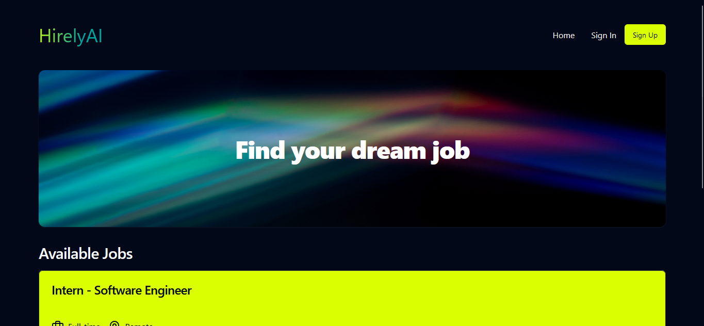
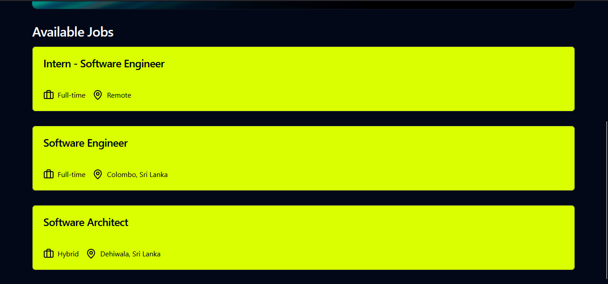
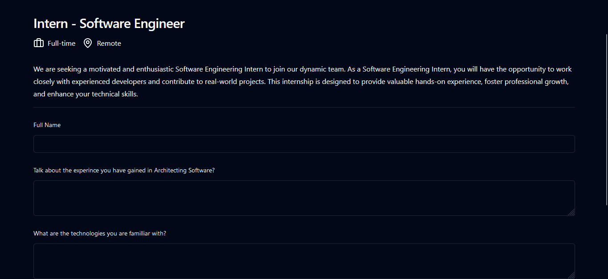
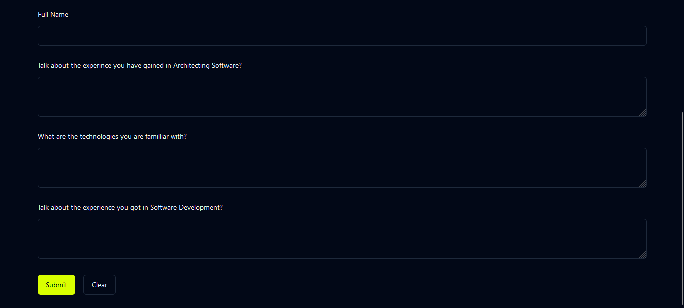

# React + Vite Hiring Web App

This project is a front-end hiring web application built using React, Vite, and Tailwind CSS. It allows users to apply for jobs by answering a series of questions.

## Features

- **User-friendly Interface:** A clean and responsive design using Tailwind CSS.
- **Job Application Form:** A dynamic form that asks users specific questions as part of the job application process.
- **Fast Development:** Vite ensures a fast and efficient development experience.

# Screenshots

